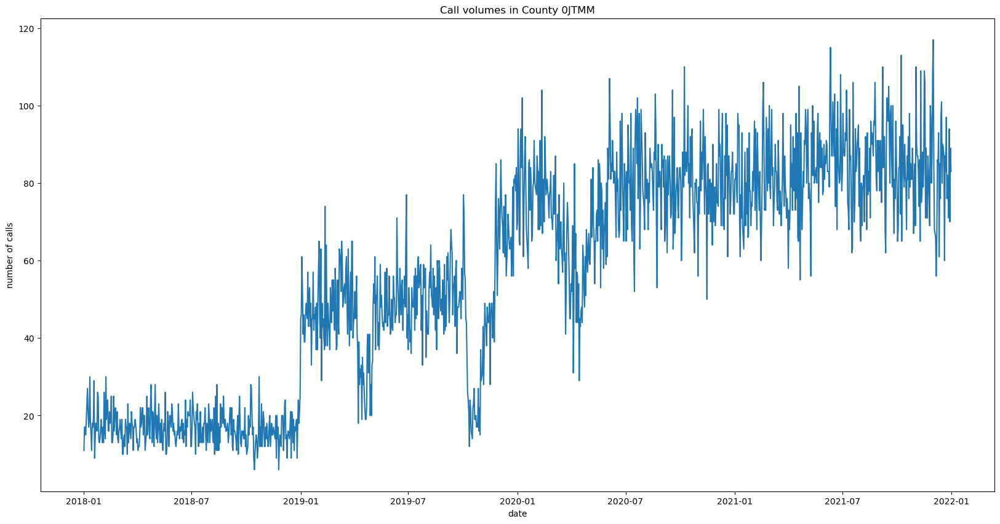
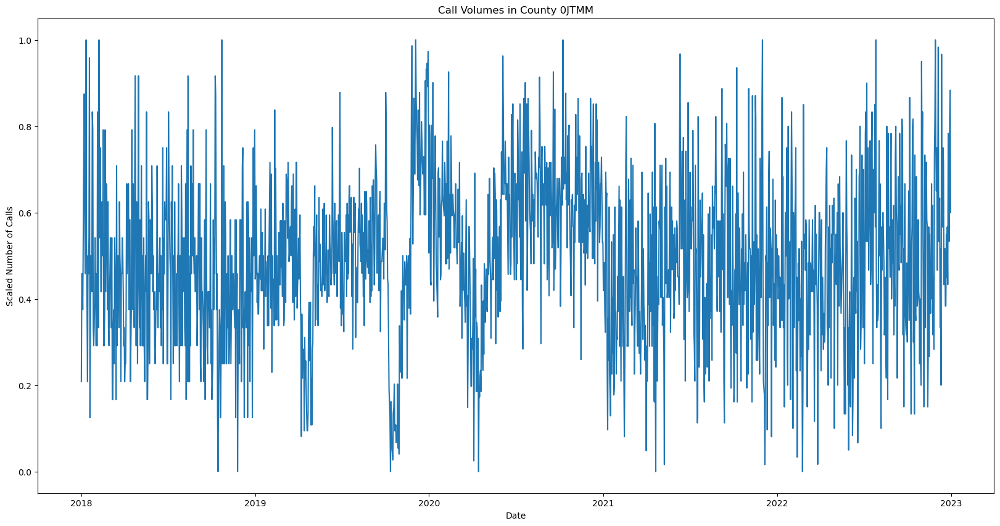
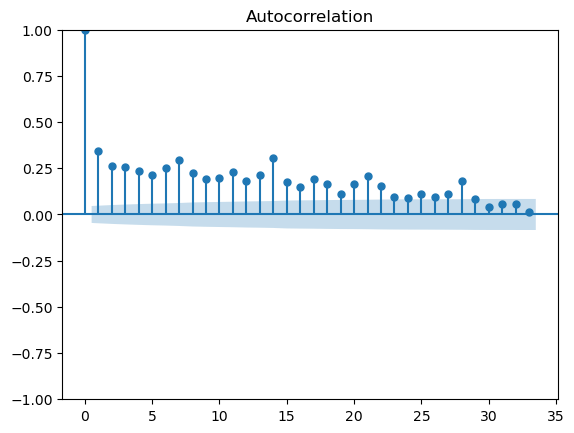
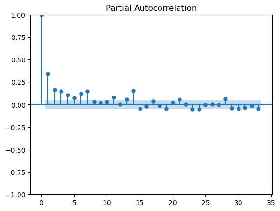
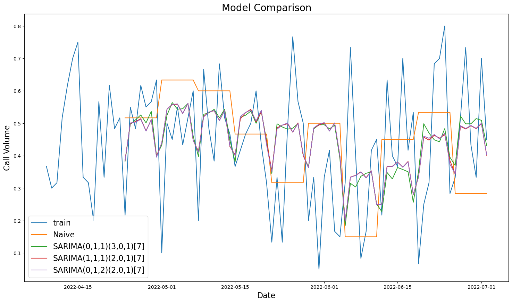

# Predicting Call Volumes for Emergency Medical Services (EMS)
### Erdos Institute data science project, Fall 2024

## Authors
- [Darius Alizadeh](https://github.com/dariusdalizadeh)
- [Karina Cho](https://github.com/kurrynacho)
- [Jessica Liu](https://github.com/jessicaliu11)
- [Jonathan Miller](https://github.com/mllrjo)

## Summary

Our broad goal is to predict the volume of different types of Emergency Medical Service (EMS) calls within a certain time interval with time series methods. 

## Data

We work with a data set provided by the National Emergency Medical Services Information System (NEMSIS), a product of the National Highway Safety Administration's EMS Office that sets the standard for EMS agencies to collect and report data. In order to obtain the data, we applied for and received approval directly from NEMSIS. NEMSIS consolidates EMS data from 54 participating states and territories into a national database. We have obtained public datasets from 2018 through 2023 that are purged of identifying information to comply with privacy law. A single EMS event is represented by (possibly multiple) EMS activations when multiple units respond to the scene. Each EMS activation is tagged by a unique identifier labeled PcrKey. 

The dataset is anonymized and does not contain any location data more granular than Census Division. We obtained additional permission to receive files which identified the county and state of each PcrKey by a five digit code. This allowed us to consolidate the data by county and state. Since we are not able to know which real life county or state corresponds to the five digit code, we are not able to use specific features of a county or state in our analysis. That being said, an stakeholder who has access to that information would likely benefit from adding location dependent exogenous regressors such as temperature into the ARIMA models. 

The NEMSIS data standard is currently on version 3, which encompasses the years 2018-2023. We chose to limit our analysis to these years both for the convenience of preprocessing as well as hard drive space limitations (each year has over 100GB of data). 

## Exploratory Data Analysis

(Summarize interesting EDA)

## Data Engineering and Preprocessing

(Summarize work done on data engineering in SQL)

 

Plotting the time series data for the call volume, we see that the data has a lot of instability. In particular, we see increases in call volumes between years, which is likely due to more EMS centers reporting data over time. To account for this, we normalize the call volume for each year to obtain a more stationary data set, which is necessary in order to fit SARIMA models.

 

## Modeling
### SARIMA Models

Based on the EDA, there seems to be a seasonal component to the data, which can be captured by a SARIMA model. Since each county appeared to have different behaviour, we decided to train models on single counties. Here, we describe the process for producing a model for a single county.

We perform analysis on the autocorrelation and partial autocorellation functions in order to deduce reasonable parameters for our SARIMA(p,d,q)(P,D,Q)[m] model. 

  
   

- The ACF and PACF both have significant lags at multiples of 7, which suggests that we have a seasonality of m=7.

Using the Akaike information Criterion (AIC), which estimates prediction error and allows us to weigh the relative quality of certain models, we perform our model selection by doing a stepwise search among parameters.  We select three models with low AIC values and compare these models against a baseline naive model using cross validation.

 

Here are the mean squared errors for these four models:
| Model   | MSE |
| -------- | ------- |
| Naive model                | 0.05129    |
| SARIMA(0,1,1)(3,0,1)[7]    | 0.03308    |
| SARIMA(1,1,1)(2,0,1)[7]    | 0.03244    |
| SARIMA(0,1,2)(2,0,1)[7]    | 0.03240    |

The naive model had the largest MSE, and all three selected SARIMA models cut the error by over a third. The SARIMA(1,2,2)(2,0,1)[7] performed the best.
### Combining State Space and SARIMA Models
#### State Space Models
1. **Exponential Smoothing**
2. **Prophet**

#### Combining State Space Models with ARIMA
- **Extracting the Trend**
- **Steps for Modeling**
    1. Decompose the time series into a trend and a remainder
    3. Apply a state space model to predict the trend
    4. Apply SARIMA to predict the remainder
    5. Recombine predictions
#### Results
### Dataset Results
**Testing on some counties: 10 fold Train-Test split with 14 day forecasts**  
**Dataset Size:** 4,614,204  
| Model                        | MSE           | MAE         | NMSE    |
|------------------------------|---------------|-------------|---------|
| prophet_predict_withlockdown | 70,227.38     | 199.94      | 0.1832  |
| arima                        | 124,313.78    | 246.13      | 0.3243  |
| constant_predict             | 164,891.20    | 369.62      | 0.4301  |
| naive_predict                | 383,336.83    | 530.07      | 1.0000  |

**Dataset Size:** 3,324,626  
| Model                        | MSE           | MAE         | NMSE    |
|------------------------------|---------------|-------------|---------|
| arima                        | 473,555.52    | 363.00      | 0.9510  |
| constant_predict             | 281,395.96    | 415.90      | 0.5651  |
| prophet_predict_withlockdown | 439,850.00    | 464.46      | 0.8833  |
| naive_predict                | 497,981.24    | 488.71      | 1.0000  |

**Dataset Size:** 3,132,673  
| Model                        | MSE           | MAE         | NMSE    |
|------------------------------|---------------|-------------|---------|
| arima                        | 78,391.64     | 152.42      | 1.0120  |
| naive_predict                | 77,461.80     | 178.90      | 1.0000  |
| prophet_predict_withlockdown | 578,567.80    | 700.41      | 7.4691  |
| constant_predict             | 670,241.91    | 772.42      | 8.6525  |

**Dataset Size:** 3,104,283  
| Model                        | MSE           | MAE         | NMSE    |
|------------------------------|---------------|-------------|---------|
| prophet_predict_withlockdown | 19,020.82     | 111.03      | 0.1663  |
| arima                        | 20,878.47     | 112.99      | 0.1825  |
| constant_predict             | 39,297.88     | 166.37      | 0.3435  |
| naive_predict                | 114,408.34    | 286.34      | 1.0000  |

**Dataset Size:** 2,232,254  
| Model                        | MSE           | MAE         | NMSE    |
|------------------------------|---------------|-------------|---------|
| arima                        | 16,280.18     | 99.72       | 0.5762  |
| prophet_predict_withlockdown | 26,424.56     | 118.26      | 0.9352  |
| constant_predict             | 24,254.55     | 123.17      | 0.8584  |
| naive_predict                | 28,256.08     | 134.11      | 1.0000  |

**Dataset Size:** 2,215,539  
| Model                        | MSE           | MAE         | NMSE    |
|------------------------------|---------------|-------------|---------|
| arima                        | 14,869.87     | 85.61       | 0.0782  |
| prophet_predict_withlockdown | 21,089.88     | 112.89      | 0.1109  |
| constant_predict             | 52,931.25     | 175.47      | 0.2784  |
| naive_predict                | 190,139.14    | 383.14      | 1.0000  |

**Dataset Size:** 2,030,960  
| Model                        | MSE           | MAE         | NMSE    |
|------------------------------|---------------|-------------|---------|
| prophet_predict_withlockdown | 7,996.82      | 63.61       | 0.1278  |
| arima                        | 7,740.49      | 66.25       | 0.1237  |
| constant_predict             | 15,208.00     | 97.97       | 0.2430  |
| naive_predict                | 62,591.27     | 213.15      | 1.0000  |

**Dataset Size:** 1,877,742  
| Model                        | MSE           | MAE         | NMSE    |
|------------------------------|---------------|-------------|---------|
| prophet_predict_withlockdown | 89,623.09     | 257.50      | 0.3827  |
| arima                        | 96,193.15     | 266.12      | 0.4108  |
| constant_predict             | 106,887.34    | 282.83      | 0.4565  |
| naive_predict                | 234,160.31    | 405.79      | 1.0000  |

**Dataset Size:** 1,844,904  
| Model                        | MSE           | MAE         | NMSE    |
|------------------------------|---------------|-------------|---------|
| arima                        | 7,699.62      | 71.24       | 0.5049  |
| naive_predict                | 15,249.86     | 103.87      | 1.0000  |
| prophet_predict_withlockdown | 344,034.64    | 536.17      | 22.5599 |
| constant_predict             | 370,721.94    | 601.90      | 24.3099 |

**Average performance for the above counties:**

| Model                                  | Score    |
|----------------------------------------|----------|
| **smoothing_arima_mult_120**           | 0.3963   |
| **arima**                              | 0.4626   |
| **expsmoothing_predict**               | 0.7058   |
| **naive_predict**                      | 1.0000   |
| **prophet_arima_mult_120**             | 2.2015   |
| **prophet_arima_withlockdown_mult_120**| 2.3669   |
| **prophet_predict_withlockdown**       | 3.6465   |
| **constant_predict**                   | 4.0153   |

#### States vs Counties

#### County-Size vs NMSE:
#### Future TODO's
- Implement algorithmic hyperparameter tuning for the Prophet models.  (as in https://medium.com/@sandha.iitr/tuning-parameters-of-prophet-for-forecasting-an-easy-approach-in-python-8c9a6f9be4e8)
- Add Fourier terms of time series as exogenous regressor to the ARIMA model.  (as in https://www.kaggle.com/code/kailex/arima-with-fourier-terms)
- For each specific dataset, input the periods of time where there are clear anomalies in data reporting as holidays for the Prophet models.
- Python modules would benefit from a more OOP structure.
- Add compatiblity with earlier versions of the NEMSIS data standard so more years of data can be incorporated. 
### Neural Network

## Conclusion and Recommendations 

----------------------------------------------------------------------------------------------------------------

# Documentation

## Modules

### **`loading_data.py`**
This module contains Python scripts to process large SAS datasets efficiently. The pipeline includes reading SAS files, converting them to Parquet format, filtering and merging datasets, and organizing data by state. The implementation uses **Pandas** for smaller tasks and **Dask** for distributed processing of large datasets.

1. **SAS to Parquet Conversion (`sas_to_parquet`)**:
   - Reads large SAS files in chunks and converts them to Parquet files for efficient storage and processing (essential for dataset of this size).
   - Creates a designated folder to store Parquet files if it doesn't already exist.

2. **Parquet File Loading (`parquet_to_df`)**:
   - Combines Parquet files from a folder into a single Dask DataFrame.

3. **Filtered DataFrame Creation (`filtered_df`)**:
   - Returns a filtered DataFrame with only the specified columns.

4. **State ID Addition (`add_state_id`)**:
   - Adds masked state identifiers by merging with a CSV mapping file.
   - Saves the combined dataset to Parquet format.

5. **State-Based File Separation (`separate_to_states`)**:
   - Separates the dataset into individual files based on unique state identifiers.
   - Saves each state's data as a separate Parquet file.

6. **Unique State Extraction (`unique_states`)**:
   - Extracts unique state identifiers from a CSV file for downstream tasks.

7. **State-Based Data Loading (`load_states`)**:
   - Dynamically loads data for specified states into a dictionary for easy access.

---

### **`preprocessing.py`**
This module provides a comprehensive toolkit for processing and analyzing the time series data. The methods include cleaning, scaling, transforming, and extracting trends from time series data, with support for both **Pandas** and **Dask** DataFrames.

1. **Subset Data (`subset_data`)**:
   - Extracts a subset of the dataset based on a specific column value.

2. **Time Series Extraction (`get_time_series`)**:
   - Converts a dataset into a time series by parsing and normalizing date and time information.

3. **Outlier Removal (`remove_outliers`)**:
   - Detects and removes outliers in a specified column using the Interquartile Range (IQR) method.
   - Replaces outliers with the column's mean.

4. **Data Scaling (`scale_data`)**:
   - Scales data in a specified column to the range [0, 1] using Min-Max scaling.

5. **Remove Zero Values (`drop_zeros`)**:
   - Removes rows where the specified column has a value of zero.

6. **Processed Time Series Creation (`get_processed_series`)**:
   - Combines multiple processing steps:
     - Extracts a time series.
     - Removes outliers.
     - Scales the data.
     - Drops rows with zero values.

7. **Train-Test Split (`time_series_split`)**:
   - Splits the time series into training and testing datasets, preserving temporal order.

8. **Weekly Data Conversion (`convert_to_weekly`)**:
   - Aggregates the time series data into weekly intervals.

9. **Monthly Data Conversion (`convert_to_monthly`)**:
   - Aggregates the time series data into monthly intervals.

10. **Trend Extraction (`get_trend`)**:
    - Calculates a smoothed trend for the time series using a rolling mean with a specified window size.

### forecasting.py

This module provides advanced forecasting techniques for the time series data. 

#### Key Function: The `ttsplit_predictions` function performs the following:
1. **Train-Test-Split**:
   - Splits the data into train-test pairs, can set _f_ as the number of testing folds and _s_ as the length of each forecast.  

2. **Models**:
   - Can specify models to test: ARIMA, auto_arima, prophet, prophet with lockdown dates, exponential smoothing. 
   - Can test models which combine prophet/prophet with lockdown dates/exponential smoothing to model the trend with Arima to model the remainder.
   - Can set ARIMA to do hyperparameter tuning just once at the beginning of train test split or once for every fold.
   - Always computes the naive and constant forecasts for the sake of comparison. 

3. **Parameter Tuning**:
   - Performs grid search on hyperparameters for combining a state-space model and arima with user-specified set of hyperparamters. 
   - 
Can accomodate weekly or monthly data by setting weekly=True or monthly=True. 

#### Forecasting Models
1. **Prophet Predictions**:
   - **Daily Prophet** (`prophet_predict`): Forecasts future counts using Prophet on a monthly scale.

   - **Monthly Prophet** (`monthly_prophet_predict`): Forecasts future counts using Prophet on a monthly scale.
   - **Weekly Prophet** (`weekly_prophet_predict`): Forecasts future counts using Prophet on a weekly scale.
   - **Prophet with Lockdowns**:
     - **Daily** (`prophet_predict_withlockdown`)
     - **Monthly** (`monthly_prophet_predict_withlockdown`)
     - **Weekly** (`weekly_prophet_predict_withlockdown`)

3. **ARIMA-Based Models**:
   - **Auto ARIMA** (`autoarima_predict`): Automatically selects the best ARIMA model using the BIC criterion.
   - **Exponential Smoothing + ARIMA** (`smoothing_arima`)
   - **Prophet + ARIMA**:
     - Standard (`prophet_arima`)
     - With Lockdowns (`prophet_arima_withlockdown`)

5. **Naive and Constant Models**:
   - **Naive Predict** (`naive_predict`): Repeats the last observed value.
   - **Constant Predict** (`constant_predict`): Uses the average of all observed values.

#### Evaluation and Model Validation
1. **Holdout Values** (`holdout_values`):
   - Retrieves actual values for evaluation from the holdout set.

2. **Model Evaluation** (`evaluate_predictions`):
   - Computes metrics for each model and returns as a dataframe:
     - Mean Squared Error (MSE)
     - Mean Absolute Error (MAE)
     - Normalized MSE (NMSE)

###plotting.py
1. **Plot Data (`plot_data`)**:
   - **Description**: Plots the 'count' column over time using the 'date' column from the dataset.
   - **Purpose**: Provides a basic visualization of the time series data to observe overall trends and patterns.

2. **Plot Predictions (`plot_predictions`)**:
   - **Description**: Plots the actual data alongside model predictions over a specified length of time.
   - **Purpose**: Helps visualize and compare the performance of different forecasting models against the actual data.
   - **Parameters**:
     - `data`: The original dataset containing 'date' and 'count'.
     - `predictions_dict`: A dictionary where keys are model names and values are prediction arrays.
     - `length`: The number of data points to plot from the end of the dataset.

3. **Plot Smoothed Data (`plot_smoothed_data`)**:
   - **Description**: Plots the original data along with its moving average trend using a specified window size.
   - **Purpose**: Visualizes the underlying trend in the data by smoothing out short-term fluctuations.
   - **Parameters**:
     - `data`: The dataset containing 'date' and 'count'.
     - `window_size`: The size of the moving window for calculating the trend (default is 180).

4. **Plot Trend and Detrended Data (`plot_trend_residue`)**:
   - **Description**: Plots the trend and the detrended data (residuals) using either multiplicative or additive methods.
   - **Purpose**: Helps in analyzing how the data deviates from the trend component.
   - **Parameters**:
     - `data`: The dataset containing 'date' and 'count'.
     - `window_size`: The size of the moving window for calculating the trend (default is 180).
     - `type`: Specifies the detrending method; 'mult' for multiplicative or 'add' for additive.

5. **FFT Plot (`fftplot`)**:
   - **Description**: Performs Fast Fourier Transform (FFT) on the data and plots the frequency spectrum.
   - **Purpose**: Identifies dominant frequencies in the time series to identify periodic patterns.
   - **Parameters**:
     - `data`: The dataset containing 'count'.
     - `frequency_scaler`: A factor to adjust the range of frequencies displayed (default is 2).

6. **Periodogram Plot (`pgram_plot`)**:
   - **Description**: Plots the periodogram, finds peaks of the spectrum, and prints dominant frequencies/periods.
   - **Purpose**: Provides detailed information about the spectrum to detect and quantify periodicities in the data.
   - **Parameters**:
     - `data`: The dataset containing 'count`.
   - **Output**:
     - A plot of the periodogram.
     - Printed list of dominant frequencies, their corresponding periods, and power levels.

